# EVM BitStream

> Decentralized File Hosting incentiviced via trustless payments on the EVM. Inspired by BitStream.

This project is based on the Bitstream Protocol paper which brings trustless and paid downloads to Bitcoin. The
protocol is adapted to work with the EVM. This repository contains the server, the smart contracts and a TypeScript
library to interact with the server.

## Getting Started

*TBD*

## Protocol Overview

Here you find sequence diagrams which describe the most important flows of the file retrieval and payment.

### Requesting a File

```mermaid
sequenceDiagram
    participant A as Alice
    participant S as Server
    participant SC as Smart Contract
    A->>+S: GET <URL>/<FILE_ID>
    S-->-A: HTTP 402 w/ Invoice Info
    Note over A,S: Contains payment details e.g.<br/> token, amount, file size.
    A->>+SC: Checks Server Bonds
    SC-->>-A: Ok
    A->>SC: Create Channel
    A->>+S: GET <URL>/<FILE_ID> + channelId
    S->>SC: Checks if channel exists
    SC-->>S: Channel funded
    S-->>-A: File w/ invoice
    A->>S: Adds HTLC to channel
    S-->>A: Advances channel + preimage
    A->>A: Decrypts + checks file
```

If the file does not decrypt correctly we can now hold the server accountable and can get a refund from the server bonds which we previously checked to be higher than what we have paid.

If the server refuses to return a consolidate a channel state with his signature, Alice can wait until the HTLC is expired and then
close the channel and return the funds.

Important takeaways:

* The server bond must be longer time locked as the HTLC because if the server releases the secret last second we need time to verify
  if the decrytped file was okay or if the server cheated us.

A sign channel state
A seq: 1, adds HTLC + new state, sign -> S
S verifies HTLC, sends preimage
A verifies preimage consolidate state without HTLC signs it -> S
A seq: 2, adds HTLC + new state, sign -> S
S verifies HTLC, sends preimage
A verifies preimage consolidate state without HTLC signs it -> S

## Further Development Options

* Private payments
* Statistics for earnings
* Automatic optimization and downloads of high revenue files from the network
* File pruning for old files or files that don't produce revenue
* Seeding into IPFS prepaid by the user
* Zero Knowledge Proof for fault proof to save on gas costs
* Distributed List of available, buyable files
* Verifiable licence cost payments for files

## Contributing

*TBD*
